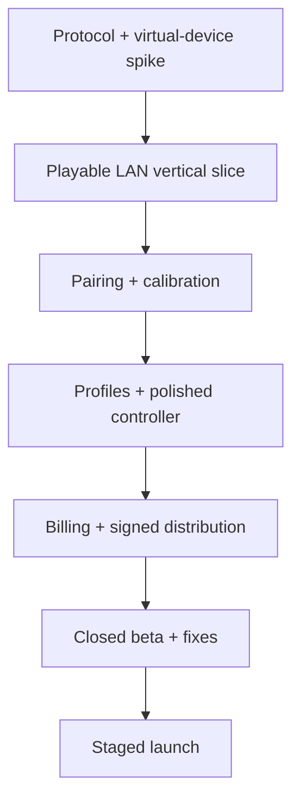

# Virtual Steering Controller — 12-Week Project Execution Plan

## 1. Delivery objective

In three months, deliver a production-quality Android-first public beta consisting of:

- Native Android controller.
- Windows 10/11 receiver.
- Xbox-compatible virtual-controller output.
- Automatic discovery and secure pairing.
- Tilt and touch-wheel steering, pedals, buttons, calibration, and profiles.
- Free/lifetime Pro monetization foundation.
- Product website, downloads, documentation, privacy, and support.
- Closed testing evidence and a staged Play Store release candidate.

This schedule assumes one highly committed developer using AI assistance, roughly 35–50 focused hours per week. If available time is materially lower, public release moves later or advanced layout editing/cloud features must be deferred.

## 2. Execution principles

- Build the latency-critical vertical slice first.
- Maintain a playable build every week after week 3.
- Freeze MVP scope at the end of week 2.
- Test on physical Android and Windows hardware continuously.
- Treat installer, driver, firewall, pairing, billing, and policies as product work.
- Do not postpone signing, store setup, privacy, or tester recruitment until the final week.
- Use feature flags for incomplete cloud and monetization features.
- Defer features before reducing fail-safe, security, or test quality.

## 3. Critical path

Virtual-controller feasibility and Windows distribution are the two earliest go/no-go risks.

## 4. Milestones

| Milestone | Target | Exit condition |
|---|---|---|
| M0 Product lock | End of week 1 | Scope, brand shortlist, architecture, risks documented |
| M1 Technical proof | End of week 2 | Phone input controls a Windows test device over LAN |
| M2 Playable alpha | End of week 4 | One game playable for 30 minutes with fail-safe disconnect |
| M3 Feature-complete MVP | End of week 7 | All core user flows implemented behind flags |
| M4 Closed beta | End of week 9 | Signed beta, onboarding/docs, payments sandboxed |
| M5 Release candidate | End of week 11 | Quality gates and policy checklist passed |
| M6 Staged launch | End of week 12 | Store rollout started with monitoring/support ready |

## 5. Week-by-week execution

### Week 1 — Product foundation and risk removal

Goals: lock scope, establish the repository, start store/signing lead-time tasks, and investigate risky dependencies.

Product:

- [ ] Confirm initial games and obtain access for testing.
- [ ] Interview at least 8–10 target users about current controls, setup pain, and willingness to pay.
- [ ] Define free, Pro Lifetime, and optional Cloud hypotheses.
- [ ] Create brand-name shortlist and begin trademark/domain/store searches.
- [ ] Define event taxonomy and privacy boundaries.
- [ ] Freeze MVP/non-goals draft.

Engineering:

- [ ] Create monorepo and contribution conventions.
- [ ] Scaffold Kotlin/Compose app.
- [ ] Scaffold Rust/Tauri receiver.
- [ ] Scaffold protocol spec and golden-test-vector package.
- [ ] Add CI formatting, linting, and unit-test jobs.
- [ ] Spike Android gyro/rotation-vector sampling on physical devices.
- [ ] Spike UDP phone-to-PC transmission with timestamps and sequence numbers.
- [ ] Evaluate virtual-controller backends, licences, driver installation, Windows versions, and force feedback.
- [ ] Write architecture decision records for stack and driver direction.

Business/release:

- [ ] Create/verify Play Console account early.
- [ ] Check current personal-account testing requirements.
- [ ] Begin Windows code-signing certificate procurement.
- [ ] Reserve domain and social handles only after reasonable name clearance.
- [ ] Establish a tester recruitment form.

Exit criteria:

- Sensor samples visible with stable monotonic timing.
- UDP packets received by Windows.
- Virtual-device approach has a documented primary and fallback.
- No unresolved legal blocker in selected dependencies.

### Week 2 — Protocol and end-to-end technical proof

Goals: produce the smallest complete input path and lock contracts.

- [ ] Define protocol v1 header, input packet, feedback packet, capability negotiation, and errors.
- [ ] Implement Kotlin encoder and Rust decoder.
- [ ] Add cross-language golden vectors.
- [ ] Add sequence, timestamp, length validation, and basic session ID.
- [ ] Implement receiver input pipeline and fake backend.
- [ ] Connect selected virtual-device backend.
- [ ] Send steering and trigger axes into Windows controller test UI.
- [ ] Implement Android tilt steering prototype and two touch pedals.
- [ ] Measure publish rate, RTT, jitter, decode time, and virtual-submit time.
- [ ] Test 60, 120, and 240 Hz packet rates.
- [ ] Add initial timeout neutralization.
- [ ] Decide minimum Android and Windows versions based on evidence.
- [ ] Freeze launch MVP at week end.

Exit criteria:

- Physical phone controls a virtual Xbox-compatible device.
- Hard disconnect releases steering, pedals, and buttons.
- Protocol parser rejects malformed test cases.
- At least one PC game receives recognizable analog input.

### Week 3 — Discovery, secure pairing, and lifecycle

Goals: remove manual IP setup and create robust session states.

- [ ] Implement mDNS/DNS-SD discovery.
- [ ] Implement UDP/manual-address fallback.
- [ ] Build receiver pairing-mode screen with QR and short-lived PIN.
- [ ] Implement device identity, challenge, trusted-device storage, and session-key derivation.
- [ ] Authenticate UDP input packets.
- [ ] Reject replayed, malformed, and wrong-session packets.
- [ ] Build Android receiver-selection and pairing screens.
- [ ] Implement remembered receiver reconnect.
- [ ] Add session state machine, heartbeat, degraded state, reconnect, and teardown.
- [ ] Add receiver UI for trusted-device rename/revoke.
- [ ] Test app background, screen rotation, Wi-Fi change, PC sleep, receiver restart, and phone lock.

Exit criteria:

- New user pairs via QR/PIN.
- Returning user reconnects automatically.
- LAN packet injection without session credentials fails.
- Every disconnect path neutralizes the controller.

### Week 4 — Playable steering alpha

Goals: make one supported racing game genuinely playable.

- [ ] Implement orientation compensation and neutral calibration.
- [ ] Implement tilt steering, touch wheel, auto-centre, and rotation range.
- [ ] Implement throttle, brake, clutch, handbrake, gears, and core buttons.
- [ ] Add dead zone, sensitivity, linearity, inversion, saturation, and bounded smoothing.
- [ ] Build distraction-free controller screen.
- [ ] Add layout lock, opacity, handedness, touch cancellation, and screen-awake behaviour.
- [ ] Build receiver live input tester.
- [ ] Create first game profile with documented in-game settings.
- [ ] Conduct 30-, 60-, and 120-minute soak sessions.
- [ ] Profile battery, CPU, allocations, frame drops, and phone temperature.
- [ ] Record baseline latency and jitter on at least three network configurations.

Exit criteria:

- One game is playable for 30 minutes without stuck controls or receiver restart.
- Steering feels consistent at stable network conditions.
- Baseline performance report exists.

### Week 5 — Calibration, profiles, and diagnostics

Goals: make setup repeatable across devices and games.

- [ ] Build calibration wizard: neutral, full lock, pedals, button test.
- [ ] Provide live raw versus processed axis visualization.
- [ ] Implement profile schema version 1.
- [ ] Add create, duplicate, rename, edit, reset, import, and export.
- [ ] Separate layout, processing, mapping, and game-association data.
- [ ] Add built-in profiles for 3–5 accessible games.
- [ ] Add RTT, jitter, loss, reorder, sample-age, and receiver-processing diagnostics.
- [ ] Create network health classifications with actionable guidance.
- [ ] Add structured logs and redaction.
- [ ] Build user-triggered support bundle export.
- [ ] Test profile migration and corrupted-profile recovery.

Exit criteria:

- A tester can calibrate without developer explanation.
- Switching game profiles changes mappings safely.
- Support bundle explains common failures without containing secrets.

### Week 6 — Premium UI and layout editing

Goals: transform the alpha into a coherent premium product.

- [ ] Finalize visual identity, design tokens, typography, icons, colours, and motion rules.
- [ ] Create high-fidelity designs for onboarding, home, pairing, controller, calibration, profiles, editor, diagnostics, paywall, and settings.
- [ ] Implement responsive layouts across target aspect ratios.
- [ ] Build basic drag/resize layout editor.
- [ ] Add snapping, safe areas, undo/redo, duplicate, delete, layer order, and reset where feasible.
- [ ] Add accessibility labels, contrast, reduced motion, and large-control presets.
- [ ] Optimize Compose recomposition and rendering.
- [ ] Polish receiver setup, dashboard, device, profile, diagnostics, and update screens.
- [ ] Run five observed usability sessions.

Scope rule: if the editor threatens the schedule, ship a constrained editor supporting position/size/opacity and defer arbitrary assets/layers.

Exit criteria:

- Core flows work on small, medium, and large Android screens.
- User can modify and safely lock a layout.
- UI achieves stable frame pacing during gameplay.

### Week 7 — Haptics, compatibility, and feature-complete MVP

Goals: complete the promised feature set.

- [ ] Capture supported virtual-device force-feedback events.
- [ ] Define normalized feedback envelope.
- [ ] Implement independent feedback transport.
- [ ] Render mobile haptics with intensity controls and capability fallback.
- [ ] Add UI haptics separately.
- [ ] Complete built-in game profiles and compatibility notes.
- [ ] Test multiple controller conflicts and Steam Input interactions.
- [ ] Add first-run driver/firewall health checks.
- [ ] Implement tray mode and optional startup.
- [ ] Close high-severity architecture and security issues.
- [ ] Declare feature-complete cutoff.

Exit criteria:

- All MVP user stories are implemented or explicitly removed from launch scope.
- Force feedback cannot block control traffic.
- Compatibility matrix contains evidence for tested games.

### Week 8 — Accounts, entitlements, and billing

Goals: make the product commercially operable without harming offline play.

- [ ] Implement backend identity only if needed for launch features.
- [ ] Model products, purchases, entitlements, devices, and audit events.
- [ ] Integrate Play Billing products in sandbox.
- [ ] Implement server-side purchase verification.
- [ ] Handle purchase, pending, cancel, renew, expire, grace, hold, refund, revoke, restore, and network-failure states.
- [ ] Implement secure local entitlement cache and offline grace.
- [ ] Add feature gates at domain boundaries, not scattered UI booleans.
- [ ] Build pricing/paywall/restore/manage-subscription UI.
- [ ] Add privacy controls and account/cloud-data deletion if accounts ship.
- [ ] Verify that local gameplay does not call the backend in its critical path.
- [ ] Perform current Play payments-policy review.

Exit criteria:

- Sandbox purchase and restoration work across reinstall scenarios.
- Refund/revocation test changes entitlement.
- Existing Pro user can play during temporary backend outage.

### Week 9 — Distribution, website, and closed beta

Goals: create a trustworthy install journey and put it in testers’ hands.

- [ ] Finalize Windows installer, upgrade, repair, and uninstall.
- [ ] Sign receiver executable, installer, updater artifacts, and manifest.
- [ ] Verify clean install on Windows 10/11 physical/VM environments.
- [ ] Test standard user versus administrator flows.
- [ ] Build production landing and download pages.
- [ ] Publish getting-started, pairing, calibration, firewall, driver, latency, and uninstall guides.
- [ ] Publish checksums, release notes, privacy policy, terms, and support route.
- [ ] Prepare Play closed-testing release and store listing draft.
- [ ] Recruit 50+ testers across devices, routers, and games.
- [ ] Establish bug-report template and severity triage.
- [ ] Start daily crash, pairing, and latency review.

Exit criteria:

- External tester installs without direct developer help.
- Downloaded receiver has valid signature and verified update metadata.
- Closed test is active and collecting structured feedback.

### Week 10 — Reliability and network torture testing

Goals: eliminate release-blocking failures.

- [ ] Simulate latency, jitter, loss, duplication, reordering, disconnection, and interface changes.
- [ ] Run overnight soak tests.
- [ ] Test routers with multicast isolation or guest-network restrictions.
- [ ] Test mobile hotspot and Ethernet-PC combinations.
- [ ] Test battery saver, thermal throttling, calls/notifications, app backgrounding, and permission denial.
- [ ] Fuzz protocol decoders and imported profile parser.
- [ ] Review logs for secrets and personal data.
- [ ] Threat-model pairing, updates, profiles, purchases, and admin access.
- [ ] Resolve all P0/P1 issues and top activation blockers.
- [ ] Reduce installer false positives and document remaining warnings accurately.
- [ ] Measure crash-free rates and activation funnel.

Exit criteria:

- No known path leaves throttle/buttons stuck.
- No open P0 issues; P1 issues have fixes or launch-blocking status.
- Crash-free and pairing-success beta thresholds are met or root-caused.

### Week 11 — Release candidate and store compliance

Goals: freeze code and pass launch readiness.

- [ ] Create release candidate versions for Android, receiver, API, and website.
- [ ] Verify compatibility matrix and minimum versions.
- [ ] Complete Play Data Safety, content rating, app access, ads, billing, privacy, and account-deletion declarations.
- [ ] Produce icon, feature graphic, screenshots, short description, full description, and preview video.
- [ ] Run purchase licence tests in Play release track.
- [ ] Run clean-room onboarding with people who have never seen the app.
- [ ] Verify analytics consent and deletion behaviour.
- [ ] Verify backup/restore and database recovery procedure.
- [ ] Create incident, rollback, support, and hotfix runbooks.
- [ ] Freeze non-critical features.
- [ ] Obtain go/no-go sign-off against checklist.

Exit criteria:

- Release candidate passes all critical acceptance tests.
- Store submission contains no known policy gaps.
- Support and rollback are ready before users arrive.

### Week 12 — Staged launch and rapid stabilization

Goals: release carefully, learn, and protect reputation.

- [ ] Submit/roll out production build according to Play review timing.
- [ ] Start with a small staged percentage where available.
- [ ] Publish stable receiver and website release simultaneously.
- [ ] Monitor crash rate, pairing failures, purchase errors, support volume, and rating themes.
- [ ] Respond to P0 immediately and pause rollout if thresholds fail.
- [ ] Ship only targeted hotfixes; avoid feature additions.
- [ ] Publish launch demonstrations and creator outreach.
- [ ] Ask satisfied users for ratings only after successful sessions.
- [ ] Conduct launch retrospective.
- [ ] Prioritize version 1.1 from data rather than the original wish list.

Exit criteria:

- Stable release is available or awaiting store review with all other surfaces ready.
- Monitoring shows no uncontrolled critical regression.
- First 30-day improvement backlog is evidence-ranked.

## 6. Parallel workstreams

| Workstream | Weeks | Output |
|---|---|---|
| Product/research | 1–12 | Scope, pricing, interviews, metrics, roadmap |
| Android | 1–11 | Controller, calibration, profiles, billing |
| Windows/Rust | 1–11 | Receiver, driver, diagnostics, installer |
| Protocol/performance | 1–10 | Spec, security, benchmarks, impairment tests |
| Backend | 6–11 | Billing, entitlement, devices, optional sync |
| Design/content | 2–11 | Brand, UI, store assets, docs |
| QA/release | 1–12 | CI, devices, test matrix, beta, launch |

For a solo developer these are interleaved, not simultaneous full-time teams. Protect the critical path: receiver feasibility → vertical slice → pairing/calibration → reliability → distribution.

## 7. Definition of done by feature

A feature is done only when:

- [ ] Acceptance criteria are documented.
- [ ] Happy path and failure path are implemented.
- [ ] Unit/integration tests cover critical logic.
- [ ] Relevant physical-device testing is complete.
- [ ] Accessibility and localization-safe layout are reviewed.
- [ ] Analytics/diagnostics are added only when justified.
- [ ] Logs are redacted.
- [ ] Documentation/support impact is updated.
- [ ] Feature works after app restart, reconnect, and upgrade.
- [ ] Performance regression is checked for real-time-path changes.

## 8. Test matrix

### Android coverage

- [ ] Android 10 through current supported version.
- [ ] Low-, mid-, and high-tier CPU/GPU devices.
- [ ] 60, 90, 120, and high-refresh screens where available.
- [ ] Devices with and without gyroscope.
- [ ] Different haptic capabilities.
- [ ] Common aspect ratios, notches, navigation modes, and tablets where supported.

### Windows coverage

- [ ] Windows 10 and 11 supported builds.
- [ ] Fresh machine and upgraded machine.
- [ ] Standard and administrator users.
- [ ] Windows Defender and SmartScreen.
- [ ] Steam Input enabled/disabled.
- [ ] Existing physical controllers attached/unattached.
- [ ] Installer upgrade, repair, uninstall, and rollback.

### Network coverage

- [ ] PC Ethernet + phone Wi-Fi.
- [ ] Both devices on 2.4 GHz and 5 GHz.
- [ ] Phone hotspot.
- [ ] Guest network/client isolation.
- [ ] VPN active.
- [ ] Firewall blocked/allowed.
- [ ] Multicast unavailable with manual fallback.
- [ ] Loss/jitter/reorder impairment profiles.

### Game coverage record

For every advertised game record version, store, receiver version, profile, in-game settings, Steam Input status, test duration, known limitations, and tester/device/network context.

## 9. Release quality gates

### Block launch when

- Any known bug can leave steering, throttle, brake, or buttons stuck.
- Installer or updater integrity cannot be verified.
- Purchase restoration is unreliable.
- Privacy/store declarations are incomplete or inaccurate.
- Crash-free sessions are below 99.5% without an understood contained cause.
- Pairing success is below 90% in supported normal networks.
- Data loss occurs during profile migration.
- A critical dependency licence is unresolved.

### Launch target gates

- [ ] ≥99.5% crash-free mobile beta sessions.
- [ ] ≥99.8% crash-free receiver sessions.
- [ ] ≥95% pairing success on supported home networks.
- [ ] Median healthy-network RTT <10 ms.
- [ ] No P0 and no unmitigated P1 defects.
- [ ] 30+ external testers complete a 30-minute session.
- [ ] At least 5 advertised games have verified profiles.
- [ ] Signed Windows distribution and functional uninstall.
- [ ] Billing purchase/restore/refund/expiry paths tested.

## 10. Scope reduction order

If schedule slips, defer in this order:

1. Cloud profile sync.
2. Subscription tier; launch Lifetime Pro first.
3. Arbitrary-image/layout customization.
4. Large built-in game-profile catalogue.
5. Force-feedback variations beyond basic rumble.
6. Automatic executable profile switching.
7. Account system if Play entitlement alone is adequate.

Never cut:

- Disconnect neutralization.
- Packet validation/authentication.
- Calibration fundamentals.
- Installer integrity.
- Purchase restoration.
- Privacy/store compliance.
- Core physical-device and network testing.

## 11. Budget categories

Plan for:

- Google Play developer registration.
- Domain and email.
- Windows code-signing certificate/service.
- Physical Android test devices and optional phone mount.
- Required games for compatibility testing.
- Hosting, database, object storage, email, and monitoring.
- Design/store assets if outsourced.
- Legal review for terms, privacy, trademarks, and third-party licensing.
- Creator sponsorships and launch marketing.
- Refunds, taxes, and store fees.

Use a monthly operating budget and a separate one-time launch budget. Do not hide signing/testing costs inside cloud estimates.

## 12. Weekly operating cadence

Monday:

- Review metrics/bugs, select weekly outcome, confirm scope.

Daily:

- Build a small vertical change, test on hardware, keep main branch releasable.
- Record latency/reliability regressions immediately.

Wednesday:

- External tester build after week 4.

Friday:

- Demo a real game, not only unit tests.
- Review risk register and milestones.
- Publish concise tester release notes.

Weekend/weekly close:

- Run soak tests and backups.
- Update documentation and next-week acceptance criteria.

## 13. Post-launch first 30 days

- Maintain a hotfix-only window for the first week.
- Review support tickets and store reviews daily.
- Segment activation failures by receiver download, install, discovery, pairing, calibration, and gameplay.
- Improve top three funnel blockers before adding major features.
- Validate willingness to pay and paywall timing.
- Expand profiles only with reproducible tests.
- Decide whether version 1.1 prioritizes USB transport, editor depth, or compatibility based on evidence.
- Publish a transparent reliability update and roadmap.

## 14. Immediate next actions

1. Select a final or temporary codename.
2. Create the repository structure.
3. Open Play Console and code-signing workstreams.
4. Complete virtual-controller licensing/compatibility spike.
5. Build the Kotlin sensor → UDP → Rust receiver → fake/real controller vertical slice.
6. Recruit the first ten target users before polishing the interface.

