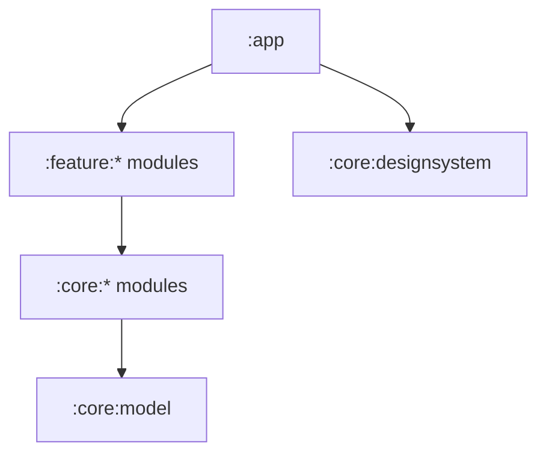

# Virtual Steering Controller — Production Repository Structure

## 1. Purpose

This document defines the production-grade monorepo for the Virtual Steering Controller product. It translates the product, technical-stack, system-architecture, and execution documents into a concrete filesystem layout with clear ownership boundaries, build conventions, generated contracts, testing strategy, release automation, security controls, and repository governance.

This is a target structure. Create directories when their first real component is implemented; do not add hundreds of empty placeholder files merely to match the tree.

Related documents:

- `Project.md` — product scope, audience, monetization, and success criteria.
- `Tech-Stack.md` — languages, frameworks, tools, and engineering standards.
- `System-architecture.md` — runtime components, data paths, protocols, and security.
- `Project-execution.md` — twelve-week delivery plan and quality gates.

## 2. Repository strategy

Use a single monorepo during the first product stages. The system has multiple runtimes—Kotlin/Android, Rust/Windows, TypeScript/web/backend—but they share protocol versions, profile schemas, release compatibility rules, test vectors, security expectations, and documentation.

A monorepo gives the project:

- Atomic changes across Android, receiver, protocol, backend, and documentation.
- One pull request for a compatible protocol evolution.
- Centralized CI, security scanning, dependency policies, and release metadata.
- Consistent issue templates, contributor expectations, and code ownership.
- Easier use by a solo developer and coding agents.
- A single source of truth for generated protocol fixtures and compatibility data.

The monorepo does **not** mean every application uses the same language, build tool, deployment, or version. Each deployable remains independently buildable and versioned.

## 3. Repository naming

Until the product name is legally cleared, use a neutral repository slug such as:

```text
virtual-steering-controller
```

Do not permanently encode the working brand into package IDs, signing identities, domains, database names, or protocol identifiers until the name passes trademark and store checks.

Recommended permanent naming scheme after brand approval:

| Concern | Example pattern |
|---|---|
| Git repository | `brand-controller` |
| Android application ID | `com.company.brand` |
| Rust workspace crates | `brand-*` |
| npm workspace packages | `@brand/*` |
| Discovery service | `_brand-control._udp.local` |
| Environment prefix | `BRAND_` |
| Protocol magic | Short versioned non-secret identifier |

## 4. Top-level repository tree

```text
virtual-steering-controller/
├── .changeset/                         # User-visible package/release change records
├── .github/
│   ├── ISSUE_TEMPLATE/
│   ├── DISCUSSION_TEMPLATE/
│   ├── PULL_REQUEST_TEMPLATE.md
│   ├── CODEOWNERS
│   ├── dependabot.yml
│   ├── labeler.yml
│   ├── release.yml
│   └── workflows/
├── .config/                            # Repository-wide tool configuration
├── .devcontainer/                      # Optional reproducible web/backend environment
├── .idea/                              # Never commit personal IDE state; only safe shared config
├── apps/
│   ├── android-controller/
│   ├── windows-receiver/
│   ├── web/
│   └── admin/
├── services/
│   └── control-plane-api/
├── packages/
│   ├── protocol-spec/
│   ├── profile-schema/
│   ├── compatibility-data/
│   ├── test-vectors/
│   ├── design-tokens/
│   ├── analytics-schema/
│   ├── api-contract/
│   └── release-manifest-schema/
├── infrastructure/
│   ├── environments/
│   ├── modules/
│   ├── monitoring/
│   └── policies/
├── tests/
│   ├── cross-platform/
│   ├── network-impairment/
│   ├── compatibility/
│   ├── installer/
│   ├── billing/
│   ├── security/
│   ├── soak/
│   └── fixtures/
├── tools/
│   ├── protocol-codegen/
│   ├── profile-validator/
│   ├── release-builder/
│   ├── diagnostic-redactor/
│   ├── network-simulator/
│   └── repository-checks/
├── docs/
│   ├── product/
│   ├── architecture/
│   ├── engineering/
│   ├── operations/
│   ├── security/
│   ├── testing/
│   ├── support/
│   ├── releases/
│   └── adr/
├── scripts/
├── assets/
│   ├── brand/
│   ├── store/
│   ├── screenshots/
│   └── diagrams/
├── legal/
│   ├── third-party-notices/
│   ├── policies/
│   └── reviews/
├── .editorconfig
├── .gitattributes
├── .gitignore
├── .pre-commit-config.yaml
├── AGENTS.md
├── CHANGELOG.md
├── CODE_OF_CONDUCT.md
├── CONTRIBUTING.md
├── LICENSE
├── NOTICE
├── README.md
├── SECURITY.md
├── SUPPORT.md
├── Taskfile.yml
├── package.json
├── pnpm-lock.yaml
├── pnpm-workspace.yaml
├── rust-toolchain.toml
├── Cargo.toml
└── renovate.json
```

## 5. Top-level ownership boundaries

| Path | Responsibility | Must not contain |
|---|---|---|
| `apps/` | User-facing executable applications | Infrastructure credentials or canonical shared schemas |
| `services/` | Independently deployed cloud services | Android/Windows real-time controller implementation |
| `packages/` | Shared contracts, schemas, fixtures, and design primitives | Deployable business services |
| `infrastructure/` | Reproducible environments and operational policies | Application secrets or mutable production data |
| `tests/` | System-level and cross-component verification | Duplicates of component-local unit tests |
| `tools/` | Developer/release programs with their own source/tests | One-off unmaintained shell fragments |
| `docs/` | Durable technical/product/operations knowledge | Generated build output |
| `scripts/` | Small orchestration entry points | Large business logic |
| `assets/` | Source-controlled approved visual assets | Unlicensed competitor assets |
| `legal/` | Policies, notices, and licence-review evidence | Private legal correspondence or personal data |

## 6. Android application structure

```text
apps/android-controller/
├── app/
│   ├── src/main/
│   │   ├── AndroidManifest.xml
│   │   ├── kotlin/com/company/controller/
│   │   │   ├── ControllerApplication.kt
│   │   │   ├── MainActivity.kt
│   │   │   ├── AppNavigation.kt
│   │   │   └── AppGraph.kt
│   │   └── res/
│   ├── src/debug/
│   ├── src/release/
│   ├── src/test/
│   ├── src/androidTest/
│   └── build.gradle.kts
├── benchmark/
├── baselineprofile/
├── core/
│   ├── model/
│   ├── protocol/
│   ├── network/
│   ├── sensors/
│   ├── controls/
│   ├── profiles/
│   ├── persistence/
│   ├── security/
│   ├── billing/
│   ├── analytics/
│   ├── diagnostics/
│   ├── designsystem/
│   └── testing/
├── feature/
│   ├── onboarding/
│   ├── pairing/
│   ├── home/
│   ├── controller/
│   ├── calibration/
│   ├── profiles/
│   ├── layouteditor/
│   ├── diagnostics/
│   ├── paywall/
│   └── settings/
├── build-logic/
│   ├── convention/
│   └── settings.gradle.kts
├── config/
│   ├── detekt.yml
│   └── lint-baseline.xml
├── gradle/
│   ├── libs.versions.toml
│   └── wrapper/
├── gradle.properties
├── gradlew
├── gradlew.bat
├── proguard-rules.pro
├── settings.gradle.kts
└── README.md
```

### 6.1 Android module dependency rules



Rules:

- Feature modules may depend on core modules but not directly on other feature implementations.
- Core modules cannot depend on feature modules.
- `core:model` contains stable domain types and has minimal dependencies.
- `core:sensors`, `core:controls`, `core:network`, and `core:protocol` do not depend on Compose.
- UI observes controller state; it does not own or schedule the real-time packet loop.
- Store Billing types remain inside `core:billing`; the rest of the app uses domain entitlement types.
- Build variants inject environment endpoints and public identifiers, never secrets.
- Test fakes live in `core:testing`, while module-specific fixtures stay with their modules.

### 6.2 Feature module internal layout

Use a consistent structure where it provides value:

```text
feature/pairing/src/main/kotlin/.../pairing/
├── domain/
│   ├── PairReceiver.kt
│   └── PairingState.kt
├── data/
│   └── PairingRepository.kt
├── presentation/
│   ├── PairingRoute.kt
│   ├── PairingScreen.kt
│   ├── PairingViewModel.kt
│   └── PairingUiState.kt
└── di/
    └── PairingModule.kt
```

Do not force layers into tiny modules that contain only forwarding classes. Organize around real boundaries and testability.

### 6.3 Real-time Android package structure

```text
core/sensors/.../
├── SensorCapabilityDetector.kt
├── SensorSource.kt
├── AndroidSensorSource.kt
├── OrientationTransform.kt
├── BiasCalibrator.kt
├── SensorFusion.kt
├── filters/
│   ├── InputFilter.kt
│   ├── LowPassFilter.kt
│   └── NoOpFilter.kt
└── metrics/
    └── SensorTimingMetrics.kt

core/controls/.../
├── ControllerState.kt
├── ControllerStateAggregator.kt
├── AxisPipeline.kt
├── ResponseCurve.kt
├── PointerOwnership.kt
├── ControlSurface.kt
└── failsafe/
    └── LocalNeutralizer.kt

core/network/.../
├── ReceiverDiscovery.kt
├── PairingClient.kt
├── SessionManager.kt
├── InputPacketPublisher.kt
├── FeedbackReceiver.kt
├── ConnectionHealth.kt
└── transport/
    ├── UdpInputTransport.kt
    └── ReliableControlTransport.kt
```

All high-frequency code should avoid unnecessary allocation, logging, JSON, database access, Compose state writes, and blocking operations.

## 7. Windows receiver structure

Use one Rust workspace inside the receiver application. Tauri is a shell around the Rust backend and web UI, not the place where domain logic lives.

```text
apps/windows-receiver/
├── Cargo.toml
├── Cargo.lock
├── crates/
│   ├── receiver-app/
│   ├── receiver-core/
│   ├── protocol/
│   ├── discovery/
│   ├── pairing/
│   ├── transport/
│   ├── input-pipeline/
│   ├── virtual-device/
│   ├── force-feedback/
│   ├── profiles/
│   ├── persistence/
│   ├── diagnostics/
│   ├── updater/
│   └── receiver-testing/
├── src-tauri/
│   ├── capabilities/
│   ├── icons/
│   ├── src/
│   │   ├── commands/
│   │   ├── events/
│   │   ├── state.rs
│   │   ├── lib.rs
│   │   └── main.rs
│   ├── build.rs
│   ├── Cargo.toml
│   └── tauri.conf.json
├── ui/
│   ├── public/
│   ├── src/
│   │   ├── app/
│   │   ├── components/
│   │   ├── features/
│   │   ├── hooks/
│   │   ├── lib/
│   │   ├── routes/
│   │   ├── styles/
│   │   └── test/
│   ├── package.json
│   ├── tsconfig.json
│   └── vite.config.ts
├── installer/
│   ├── wix/
│   ├── scripts/
│   ├── assets/
│   └── tests/
├── resources/
│   ├── built-in-profiles/
│   ├── migrations/
│   └── third-party-notices/
├── benches/
├── fuzz/
├── tests/
├── deny.toml
└── README.md
```

### 7.1 Rust crate boundaries

| Crate | Responsibility |
|---|---|
| `receiver-app` | Process lifecycle, dependency assembly, task supervision |
| `receiver-core` | Shared domain types and state machine interfaces |
| `protocol` | Wire decoder/encoder and negotiated capabilities |
| `discovery` | mDNS and UDP discovery advertisement |
| `pairing` | Challenge, trust, identity, key/session establishment |
| `transport` | UDP and reliable local transport implementations |
| `input-pipeline` | Validation, newest-state selection, mapping, neutralization |
| `virtual-device` | Replaceable virtual controller trait and backend adapters |
| `force-feedback` | Driver feedback normalization and downstream scheduling |
| `profiles` | Profile loading, migration, validation, executable association |
| `persistence` | SQLite and Windows-protected secret storage |
| `diagnostics` | Structured logs, metrics, redacted support bundle |
| `updater` | Signed manifest verification and update orchestration |
| `receiver-testing` | Fakes, packet builders, clocks, and integration harnesses |

### 7.2 Rust dependency direction

- Domain crates must not import Tauri.
- `src-tauri` calls application services and exposes narrow DTOs to the UI.
- `virtual-device` exports a stable trait; driver-specific types are private.
- `protocol` cannot depend on database, UI, billing, or driver crates.
- `input-pipeline` may depend on domain protocol types and the virtual-device interface, not a concrete driver.
- `diagnostics` receives metrics/events through interfaces; real-time crates do not synchronously format or write large logs.
- Use bounded channels with documented overflow behaviour.
- Every spawned Tokio task must have ownership, cancellation, and failure-supervision rules.

### 7.3 Tauri IPC rules

- Treat the webview as an untrusted presentation boundary.
- Expose allowlisted commands only.
- Validate all command payloads.
- Never send session keys, purchase tokens, or unrestricted filesystem paths to the UI.
- Throttle live input visualization independently from the real-time packet rate.
- The UI may request actions; Rust remains authoritative for device, session, update, and driver state.

## 8. Website structure

```text
apps/web/
├── app/
│   ├── (marketing)/
│   ├── downloads/
│   ├── docs/
│   ├── compatibility/
│   ├── pricing/
│   ├── support/
│   ├── privacy/
│   ├── terms/
│   ├── api/health/
│   ├── layout.tsx
│   └── sitemap.ts
├── components/
│   ├── marketing/
│   ├── documentation/
│   ├── download/
│   └── ui/
├── content/
│   ├── docs/
│   ├── releases/
│   ├── games/
│   └── faq/
├── lib/
│   ├── downloads/
│   ├── content/
│   ├── seo/
│   └── analytics/
├── public/
├── tests/
│   ├── unit/
│   └── e2e/
├── next.config.ts
├── package.json
└── README.md
```

Rules:

- Receiver downloads are resolved from a verified release manifest, not manually pasted URLs.
- Download pages show version, platform, signature status, checksum, release notes, and system requirements.
- Documentation content is reviewed with the application change that affects it.
- Marketing analytics must not be reused to collect controller input data.
- Privacy, terms, and support pages are versioned and deploy with auditable changes.

## 9. Admin application structure

```text
apps/admin/
├── app/
│   ├── login/
│   ├── dashboard/
│   ├── releases/
│   ├── compatibility/
│   ├── profiles/
│   ├── billing-support/
│   ├── feature-flags/
│   └── audit/
├── components/
├── lib/
│   ├── auth/
│   ├── api/
│   └── permissions/
├── tests/
└── package.json
```

The admin interface is not a general database editor. Every sensitive mutation uses a typed backend command, authorization check, confirmation where necessary, and immutable audit event. Require MFA and least-privilege roles.

## 10. Control-plane service structure

The example below assumes NestJS/TypeScript for delivery speed. If Axum/Rust is chosen, preserve the same domain boundaries rather than copying framework-specific filenames.

```text
services/control-plane-api/
├── src/
│   ├── main.ts
│   ├── app.module.ts
│   ├── config/
│   ├── common/
│   │   ├── auth/
│   │   ├── errors/
│   │   ├── logging/
│   │   ├── validation/
│   │   └── observability/
│   ├── modules/
│   │   ├── identity/
│   │   ├── installations/
│   │   ├── devices/
│   │   ├── billing/
│   │   ├── entitlements/
│   │   ├── profiles/
│   │   ├── releases/
│   │   ├── compatibility/
│   │   ├── feature-flags/
│   │   ├── analytics/
│   │   ├── privacy/
│   │   └── audit/
│   └── workers/
│       ├── billing-reconciliation/
│       ├── deletion/
│       └── retention/
├── prisma/
│   ├── schema.prisma
│   ├── migrations/
│   └── seed.ts
├── test/
│   ├── integration/
│   ├── contract/
│   └── e2e/
├── Dockerfile
├── package.json
├── tsconfig.json
└── README.md
```

### 10.1 Backend module layout

```text
modules/entitlements/
├── domain/
│   ├── entitlement.ts
│   ├── entitlement-policy.ts
│   └── entitlement.repository.ts
├── application/
│   ├── get-entitlement.query.ts
│   └── recompute-entitlement.command.ts
├── infrastructure/
│   ├── prisma-entitlement.repository.ts
│   └── signed-assertion.service.ts
├── transport/
│   ├── entitlement.controller.ts
│   └── entitlement.dto.ts
└── entitlement.module.ts
```

Rules:

- Controllers do validation/authentication and call application use cases; they do not contain billing policy.
- Store SDK responses are converted at the billing infrastructure boundary.
- Entitlements are computed server-side from verified transaction state.
- Database models do not leak as external API DTOs.
- Migrations are immutable after production deployment.
- Workers are idempotent and safe to retry.
- All billing and administrative state changes create audit events.

## 11. Shared packages

### 11.1 `packages/protocol-spec`

```text
packages/protocol-spec/
├── spec/
│   ├── protocol-v1.md
│   ├── packet-layout.yaml
│   ├── capability-registry.yaml
│   ├── error-codes.yaml
│   └── version-policy.md
├── generated/
│   ├── kotlin/
│   ├── rust/
│   └── typescript/
├── schemas/
├── tests/
├── CHANGELOG.md
└── README.md
```

The human-readable specification is canonical. Generated code is deterministic and checked by CI. A change to packet layout requires protocol tests, compatibility analysis, and an explicit version decision.

### 11.2 `packages/profile-schema`

```text
packages/profile-schema/
├── schemas/
│   ├── profile-v1.schema.json
│   ├── layout-v1.schema.json
│   └── mapping-v1.schema.json
├── examples/
├── migrations/
├── generated/
├── tests/
└── README.md
```

Keep imported profiles declarative. They may define controls and mappings, never scripts, commands, URLs that auto-execute, or arbitrary filesystem access.

### 11.3 `packages/test-vectors`

Contains byte-exact fixtures for:

- Valid input packets.
- Boundary axis/button values.
- Sequence wraparound.
- Invalid lengths and versions.
- Authentication failures.
- Force-feedback packets.
- Capability negotiation.
- Profile migrations.

Kotlin and Rust tests must consume the same fixtures.

### 11.4 `packages/compatibility-data`

```text
packages/compatibility-data/
├── games/
│   ├── forza-horizon-5.yaml
│   ├── beamng-drive.yaml
│   └── euro-truck-simulator-2.yaml
├── versions/
│   └── supported-client-matrix.yaml
├── devices/
│   └── known-device-notes.yaml
├── schema/
└── tests/
```

Each game record identifies tested game/store versions, profile version, in-game settings, Steam Input state, known limitations, evidence date, and tested receiver/client versions. Do not advertise compatibility solely because a community user said it worked once.

### 11.5 Other shared packages

- `design-tokens`: color, typography, spacing, radius, and motion values exported to Compose and web formats where practical.
- `analytics-schema`: allowlisted event names/properties and privacy classification.
- `api-contract`: OpenAPI source/generated clients and breaking-change checks.
- `release-manifest-schema`: signed manifest structure, channels, hashes, compatibility, and rollout fields.

## 12. Infrastructure structure

```text
infrastructure/
├── environments/
│   ├── local/
│   ├── staging/
│   └── production/
├── modules/
│   ├── api/
│   ├── database/
│   ├── object-storage/
│   ├── cdn/
│   ├── dns/
│   ├── monitoring/
│   └── secrets-bindings/
├── monitoring/
│   ├── dashboards/
│   ├── alerts/
│   └── slo/
├── policies/
│   ├── retention/
│   ├── backup/
│   └── access/
├── README.md
└── versions.tf
```

Rules:

- Staging and production use separate credentials, databases, buckets, and billing integrations.
- Do not commit Terraform state, plans containing secrets, certificates, private keys, service-account JSON, or production `.env` files.
- Pin provider and module versions.
- Require a plan review before production apply.
- Document backup restoration, not just backup creation.
- Keep runtime secrets in the deployment platform’s secret manager.
- Apply least privilege to CI deployment identities.

## 13. Testing structure

Component-local unit tests stay beside their source. Repository-level `tests/` contains scenarios spanning components or deployment boundaries.

```text
tests/
├── cross-platform/
│   ├── protocol-conformance/
│   ├── profile-conformance/
│   └── version-negotiation/
├── network-impairment/
│   ├── scenarios/
│   ├── expected-results/
│   └── runner/
├── compatibility/
│   ├── games/
│   ├── windows/
│   ├── android/
│   └── reports/
├── installer/
│   ├── clean-install/
│   ├── upgrade/
│   ├── repair/
│   └── uninstall/
├── billing/
│   ├── purchase/
│   ├── restore/
│   ├── refund/
│   ├── expiry/
│   └── offline-grace/
├── security/
│   ├── malformed-packets/
│   ├── replay/
│   ├── profile-import/
│   └── update-verification/
├── soak/
│   ├── configurations/
│   └── result-schema/
└── fixtures/
```

Generated test reports should normally be CI artifacts, not committed. Commit only reviewed compatibility evidence or compact baselines that serve as a long-term specification.

## 14. Tools and scripts

### `tools/`

Use for maintained programs with domain logic, dependencies, tests, and documentation.

Examples:

- Protocol code generation.
- Profile schema validation/migration.
- Release manifest creation and signing requests.
- Diagnostic bundle redaction verification.
- Network impairment orchestration.
- Repository policy validation.

### `scripts/`

Use for thin commands that assemble existing tools:

```text
scripts/
├── bootstrap.ps1
├── bootstrap.sh
├── check.ps1
├── check.sh
├── dev-android.ps1
├── dev-receiver.ps1
├── dev-web.sh
├── dev-api.sh
├── generate-contracts.sh
├── verify-generated.sh
└── prepare-release.ps1
```

Scripts must:

- Use strict error handling.
- Resolve paths relative to the repository root safely.
- Avoid printing secrets.
- Be idempotent where possible.
- Provide `--help` for non-obvious arguments.
- Delegate complex logic to `tools/`.
- Work non-interactively in CI when relevant.

Use `Taskfile.yml` or an equivalent task runner as the discoverable cross-project command catalog:

```text
task bootstrap
task check
task test
task generate
task android:assemble
task receiver:build
task web:dev
task api:dev
task test:protocol
task release:verify
```

## 15. Documentation structure

```text
docs/
├── product/
│   ├── Project.md
│   ├── personas.md
│   ├── monetization.md
│   └── metrics.md
├── architecture/
│   ├── System-architecture.md
│   ├── data-plane.md
│   ├── control-plane.md
│   ├── pairing.md
│   ├── protocol.md
│   └── diagrams/
├── engineering/
│   ├── Tech-Stack.md
│   ├── Repository-structure.md
│   ├── local-development.md
│   ├── coding-standards.md
│   └── dependency-policy.md
├── operations/
│   ├── deployment.md
│   ├── rollback.md
│   ├── database-restore.md
│   ├── incident-response.md
│   └── key-rotation.md
├── security/
│   ├── threat-model.md
│   ├── pairing-review.md
│   ├── update-chain.md
│   └── privacy-data-map.md
├── testing/
│   ├── Project-execution.md
│   ├── test-strategy.md
│   ├── device-matrix.md
│   └── game-compatibility-process.md
├── support/
│   ├── diagnostic-bundles.md
│   ├── known-issues.md
│   └── troubleshooting-authoring.md
├── releases/
│   ├── release-process.md
│   └── version-compatibility.md
└── adr/
    ├── README.md
    └── 0001-use-monorepo.md
```

### 15.1 Architecture decision records

Use ADRs for consequential decisions such as:

- Monorepo strategy.
- Native Kotlin rather than a cross-platform mobile framework.
- Rust/Tauri receiver.
- Virtual controller backend.
- UDP authenticated snapshot protocol.
- Managed authentication provider.
- Installer technology and code signing.
- Lifetime-plus-cloud monetization architecture.

ADR format:

```markdown
# ADR-NNNN: Decision title

- Status: Proposed | Accepted | Superseded | Rejected
- Date: YYYY-MM-DD
- Owners: roles/names

## Context
## Decision
## Alternatives considered
## Consequences
## Security/privacy impact
## Rollback or migration plan
```

Never silently rewrite an accepted ADR to change history. Add a superseding ADR.

## 16. Essential root files

### `README.md`

Keep the root README concise and operational:

1. Product description and status.
2. Architecture overview.
3. Supported platforms.
4. Repository map.
5. Prerequisites.
6. Bootstrap and common commands.
7. Testing commands.
8. Links to detailed documentation.
9. Security reporting link.
10. Licence and third-party notice link.

Do not put secrets, production endpoints, signing instructions containing sensitive identifiers, or unverified marketing claims in the README.

### `CONTRIBUTING.md`

Include:

- Development prerequisites.
- Issue selection and design-discussion expectations.
- Branch and commit conventions.
- Code generation rules.
- Test and documentation requirements.
- Pull request checklist.
- Security-sensitive change process.
- Developer Certificate of Origin or CLA policy if adopted.

### `SECURITY.md`

Include:

- Supported versions.
- Private vulnerability-reporting channel.
- Expected response windows without unrealistic guarantees.
- What information helps reproduce an issue.
- Prohibition on publishing live exploits before coordination.
- Scope covering mobile, receiver, updater, website, API, profiles, and pairing.

### `SUPPORT.md`

Distinguish:

- Usage support.
- Confirmed bugs.
- Compatibility requests.
- Billing support.
- Security disclosures.

Never ask users to post purchase tokens, secrets, or full diagnostic bundles publicly.

### `AGENTS.md`

Give coding agents repository-specific instructions:

- Architecture boundaries.
- Required commands before completion.
- Files that are generated and must not be hand-edited.
- Real-time-path performance rules.
- Security/privacy restrictions.
- Scope and naming conventions.
- Rules for database migrations and protocol changes.
- Requirement to preserve unrelated user changes.

Keep instructions actionable and repository-specific rather than duplicating general programming advice.

### `LICENSE` and `NOTICE`

Choose the product’s source licence deliberately. A commercial product does not have to expose all source. If the repository is private, still track third-party obligations. `NOTICE` and `legal/third-party-notices/` should be generated/reviewed for releases.

## 17. Git ignore and artifact policy

Commit:

- Source and tests.
- Lockfiles.
- Database migrations.
- Human-authored specifications.
- Deterministic generated code when required by downstream build systems.
- Small test fixtures and approved assets.
- Public keys/certificates explicitly safe for verification.

Do not commit:

- `.env` or local override files containing values.
- Signing private keys, keystores, passwords, certificates containing private keys, or store credentials.
- IDE user/workspace state.
- Build output: `build/`, `target/`, `.next/`, `dist/`.
- Coverage output and large profiling traces.
- Local SQLite/PostgreSQL data.
- Raw production logs or support bundles.
- Terraform state.
- Android signing files.
- Windows code-signing credentials.
- Personal test-device identifiers.
- Downloaded third-party installers unless redistribution is explicitly approved.

Use `.gitignore` plus automated secret scanning; ignore rules alone are not security.

## 18. Git attributes and line endings

Because Windows, Android, Rust, and web developers may use different operating systems, define line endings explicitly:

```gitattributes
* text=auto eol=lf
*.bat text eol=crlf
*.cmd text eol=crlf
*.ps1 text eol=crlf
*.png binary
*.jpg binary
*.ico binary
*.keystore binary
*.aab binary
*.exe binary
*.msi binary
```

Store large binary assets in appropriate artifact storage when they are release products. Do not use Git as the Windows installer CDN.

## 19. Branch and pull-request model

Use trunk-based development:

- Protected `main` branch.
- Short-lived branches: `feature/...`, `fix/...`, `docs/...`, `chore/...`.
- Pull requests required for main after the solo prototype phase.
- Rebase or squash merge according to the chosen changelog strategy.
- Delete merged branches.
- Release tags point to immutable tested commits.

Avoid a permanent `develop` branch. Use release branches only when stabilizing an already shipped supported version requires parallel hotfix work.

### Pull request requirements

- Clear problem and solution description.
- Linked issue/decision where appropriate.
- Test evidence.
- Screenshots/video for UI changes.
- Latency/CPU/allocation comparison for real-time changes.
- Migration and rollback notes for database/protocol/profile changes.
- Security/privacy analysis for trust, telemetry, billing, updater, or storage changes.
- Documentation and release-note impact.

### Review ownership

Example `CODEOWNERS` concepts:

```text
/packages/protocol-spec/       @protocol-owner
/apps/windows-receiver/crates/virtual-device/ @windows-owner @security-owner
/services/control-plane-api/src/modules/billing/ @backend-owner @billing-owner
/infrastructure/               @operations-owner
/legal/                         @product-owner
/.github/workflows/            @release-owner @security-owner
```

For a solo project these may initially point to one account, but the ownership map still documents future review boundaries.

## 20. Commit and change conventions

Use a consistent format, for example Conventional Commits:

```text
feat(android): add tilt calibration wizard
fix(receiver): neutralize triggers after packet timeout
perf(protocol): remove allocation from packet decode
docs(architecture): document session-key rotation
chore(release): prepare receiver 0.4.0-beta.2
```

Breaking protocol, API, or schema changes must be explicit. Do not rely only on commit messages for user release notes; maintain changesets or structured release entries.

## 21. Versioning strategy

Version these independently:

| Component | Version strategy |
|---|---|
| Android app | Semantic product version + monotonically increasing version code |
| Windows receiver | Semantic version |
| Protocol | Major/minor capability version |
| Profile schema | Integer schema version with migrations |
| Cloud API | Explicit compatibility/version policy |
| Release manifest | Schema version |
| Built-in profile pack | Independent content version |

Do not force all deployables to share a version number. Maintain a compatibility matrix such as:

```yaml
android: ">=1.0.0 <2.0.0"
receiver: ">=1.0.0 <2.0.0"
protocol_major: 1
profile_schema: [1]
minimum_receiver_by_mobile:
  "1.2.0": "1.1.0"
```

The canonical matrix should be machine-readable, tested, and used to generate documentation/release validation.

## 22. CI workflow structure

```text
.github/workflows/
├── pr-path-classifier.yml
├── android-check.yml
├── android-instrumented.yml
├── receiver-check.yml
├── receiver-windows-integration.yml
├── web-check.yml
├── api-check.yml
├── protocol-conformance.yml
├── generated-files.yml
├── security-scan.yml
├── dependency-review.yml
├── infrastructure-plan.yml
├── nightly-soak.yml
├── release-android.yml
├── release-receiver.yml
├── release-web-api.yml
└── release-coordinator.yml
```

### 22.1 Pull-request pipeline

Run path-aware jobs but never skip shared-contract checks when a shared package changes.

- Repository policy and formatting.
- Kotlin compile, lint, detekt, unit tests.
- Rust fmt, Clippy, unit/integration tests.
- TypeScript lint, typecheck, unit tests.
- Protocol/profile generated-code verification.
- Cross-language golden vectors.
- Database migration validation.
- Dependency licence and vulnerability checks.
- Secret scanning.
- Infrastructure format/validate/plan where relevant.

### 22.2 Scheduled pipeline

- Dependency scans against newly published vulnerabilities.
- Long-running receiver/mobile soak tests where hardware runners exist.
- Network impairment suite.
- Database backup restoration drill in non-production.
- Link and documentation validation.
- Expiring certificate/domain/credential notifications without exposing secrets.

### 22.3 Release pipeline

Android:

1. Verify tag and changelog.
2. Run release tests.
3. Build signed AAB using protected credentials.
4. Upload mapping/native symbols.
5. Publish to requested Play track with approval.
6. Record release metadata.

Windows receiver:

1. Build on controlled Windows runner.
2. Test binaries and installer.
3. Generate SBOM and third-party notices.
4. Sign executable and installer.
5. Verify signatures on a clean runner.
6. Malware scan/submission workflow.
7. Upload immutable artifacts.
8. Generate hashes and signed release manifest.
9. Promote channel only after verification.

Web/API:

1. Typecheck/test/build.
2. Validate database migration compatibility.
3. Deploy staging and run smoke tests.
4. Apply production migration with safe sequence.
5. Deploy application.
6. Verify health, key journeys, and rollback readiness.

## 23. CI security requirements

- Third-party workflow actions are pinned to immutable commit SHAs.
- Pull requests from forks cannot access release secrets.
- Use short-lived workload identity instead of long-lived cloud keys where supported.
- Separate build and signing permissions.
- Production deployments require protected environment approval.
- Signing material is never available to ordinary test jobs.
- Generated artifacts carry provenance and checksums.
- CI logs redact tokens and sensitive responses.
- Cache keys cannot allow untrusted code to poison privileged release jobs.
- Minimize default workflow token permissions and grant job-specific access.

## 24. Dependency management

- Commit `Cargo.lock`, `pnpm-lock.yaml`, and Gradle dependency/version declarations.
- Automate dependency update pull requests in small groups.
- Do not auto-merge updates affecting networking, crypto, billing, virtual drivers, updater, authentication, or build signing.
- Maintain an allow/deny policy for licences.
- Record exceptional pinned/forked dependencies with owner and review date.
- Remove unused dependencies promptly.
- Prefer ecosystem-standard maintained libraries over tiny unowned packages in critical paths.
- Generate an SBOM for production releases.

Dependency review questions:

1. Is it maintained and compatible with supported platforms?
2. Does its licence allow intended distribution and monetization?
3. Does it execute code during build/install?
4. Does it access the network or collect telemetry?
5. Is it in the real-time, update, auth, billing, or driver trust boundary?
6. Can it be wrapped and replaced?

## 25. Secrets and configuration

### Configuration hierarchy

```text
compiled safe defaults
→ committed environment-safe config
→ deployment environment variables
→ secret manager values
→ runtime feature/config service where appropriate
```

Every application provides `.env.example` or typed configuration documentation containing names and harmless placeholders only.

Examples of secrets never committed:

- Android signing keystore/passwords.
- Windows code-signing private material.
- Play service-account credentials.
- Database passwords.
- OIDC client secrets.
- Email provider/API tokens.
- Error-reporting upload tokens.
- Update signing private key.

Public verification keys may be committed when intentional. Label them clearly as public.

Configuration loaders must:

- Validate required values at startup.
- Reject unknown/unsafe values in production.
- Avoid logging resolved secrets.
- Use distinct development, test, staging, and production identities.

## 26. Database migration policy

- Every schema change is a committed migration.
- Never edit a migration already applied to shared production.
- Review generated SQL before merge.
- Prefer expand/migrate/contract for zero- or low-downtime changes.
- Backward-compatible application deployment precedes destructive cleanup.
- Add indexes concurrently or through platform-safe procedures where necessary.
- Include rollback or forward-fix notes.
- Test migrations from a recent production-like snapshot with sensitive data removed.
- Billing transaction and audit records require careful retention; do not casually cascade-delete them.

## 27. Generated code policy

Generated outputs include protocol constants, packet readers/writers, profile model bindings, OpenAPI clients, design-token exports, and release schemas.

Each generated area contains a header:

```text
GENERATED FILE — DO NOT EDIT.
Source: packages/protocol-spec/spec/packet-layout.yaml
Generator: tools/protocol-codegen
```

CI runs generation and fails if the working tree changes. The repository documents whether generated files are committed. For Kotlin/Rust cross-project contracts, committing deterministic output is acceptable when it improves reproducible builds, provided drift checks are strict.

## 28. Release artifacts and provenance

Do not commit binaries to normal source history. Release storage should contain:

- Android AAB/APK where distribution permits.
- Windows executable/installer.
- Symbols and mapping files in protected storage.
- SBOM.
- Checksums.
- Signatures.
- Third-party notices.
- Release notes.
- Machine-readable compatibility and update manifest.
- Build provenance/attestation.

Every artifact maps back to an immutable commit, CI run, toolchain versions, and release channel.

## 29. Repository security automation

Required checks:

- Secret scanning and push protection.
- Dependency vulnerability review.
- Rust `cargo audit` and licence/source policy.
- Android/Gradle dependency analysis.
- npm audit or stronger ecosystem scanner.
- Static analysis for Kotlin, Rust, and TypeScript.
- Container scanning for the API image.
- Infrastructure scanning.
- SBOM generation.
- Protocol parser fuzzing.
- Imported profile fuzzing/validation.
- Update signature and downgrade tests.

Security findings are triaged privately where disclosure creates user risk.

## 30. Performance governance

Mark the latency-critical areas explicitly:

- Android sensor acquisition and transformation.
- Controller-state aggregation.
- Packet encoding/publishing.
- Receiver UDP validation/decoding.
- Newest-state selection.
- Mapping and virtual-device submission.

Changes to these paths require:

- No synchronous disk, database, cloud, or UI calls.
- Allocation analysis.
- Benchmark comparison.
- Packet-rate and CPU measurement.
- Timeout/fail-safe verification.
- Network impairment regression test where relevant.

Store benchmark baselines as compact structured data and use reasonable regression thresholds. Do not reject harmless noise without review.

## 31. Observability repository assets

Keep observability definitions version-controlled:

```text
infrastructure/monitoring/
├── dashboards/
│   ├── activation.json
│   ├── receiver-reliability.json
│   ├── mobile-reliability.json
│   ├── billing.json
│   └── releases.json
├── alerts/
│   ├── crash-rate.yaml
│   ├── purchase-errors.yaml
│   ├── api-slo.yaml
│   └── release-regression.yaml
└── slo/
    ├── api-availability.yaml
    └── entitlement-verification.yaml
```

Local data-plane latency is primarily calculated on device/receiver. Upload only approved aggregates with consent; never create a hidden pipeline for raw steering inputs.

## 32. Issue and project management

Recommended issue types:

- Bug.
- Feature proposal.
- Compatibility report.
- Performance regression.
- Documentation problem.
- Security report redirect.
- Release task.
- Technical debt.

Labels should represent type, component, severity, platform, status, and release target. Avoid dozens of decorative labels.

Bug templates request:

- App/receiver/game/Windows/Android versions.
- Connection topology.
- Reproduction steps.
- Expected and actual result.
- Whether controls became stuck.
- Redacted diagnostic bundle attachment instructions.

Never ask for secrets, purchase tokens, or public uploads of sensitive logs.

## 33. Environment setup and developer experience

A new developer should be able to:

1. Clone the repository.
2. Run the bootstrap command.
3. Validate toolchain versions.
4. Start local PostgreSQL/API/web.
5. Build Android debug app.
6. Build receiver with a fake virtual-device backend.
7. Run protocol conformance tests.
8. Find component-specific setup instructions.

Repository setup should verify:

- JDK and Android SDK.
- Rust toolchain and Windows build tools.
- Node LTS and pinned pnpm.
- Database/container runtime.
- Optional driver availability.
- Required environment placeholders.

The fake receiver backend is essential for development and CI without privileged driver installation.

## 34. Local development environments

Use a development container for web/API/tooling if helpful, but do not pretend it replaces native Android sensor testing or Windows driver/installer testing.

Recommended local profiles:

- `dev-local`: fake purchases, fake virtual device, local database.
- `dev-hardware`: real Android sensors and Windows virtual device.
- `staging`: remote non-production backend and sandbox billing.
- `release`: production endpoints/signing only inside protected CI.

Production signing must never be possible from a standard developer profile.

## 35. Repository policy checks

Create automated checks for:

- Forbidden committed secret/file patterns.
- Generated-code drift.
- Protocol/profile schema changes without version/changelog updates.
- Database schema changes without migrations.
- Missing third-party licence metadata.
- Unbounded channels in designated real-time modules where detectable.
- Direct driver imports outside `virtual-device` adapters.
- Tauri imports outside allowed application/UI boundary.
- Raw analytics events not present in the allowlist.
- Download manifest mismatches.
- Unsupported version matrix entries.

Policy checks should explain how to fix failures and allow reviewed exceptions with an owner and expiry.

## 36. Production readiness checklist

### Repository fundamentals

- [ ] Protected main branch and required checks.
- [ ] CODEOWNERS and pull-request template.
- [ ] README, CONTRIBUTING, SECURITY, SUPPORT, licence, and notice files.
- [ ] Lockfiles committed and toolchains pinned.
- [ ] Secret scanning enabled.
- [ ] Release tags protected.
- [ ] Backups configured for repository and release assets.

### Architecture enforcement

- [ ] Real-time code isolated from UI/cloud/storage.
- [ ] Virtual-device backend replaceable.
- [ ] Shared protocol golden vectors pass in Kotlin and Rust.
- [ ] Profile and release schemas versioned.
- [ ] Compatibility matrix machine-readable.
- [ ] Task cancellation and fail-safe ownership documented.

### Build and quality

- [ ] One command runs common checks.
- [ ] Clean clone builds documented targets.
- [ ] Unit, integration, cross-platform, and installer suites exist.
- [ ] Network impairment and soak suites are repeatable.
- [ ] Generated outputs are reproducible.
- [ ] Performance baselines are recorded.

### Security and releases

- [ ] Signing credentials isolated from normal CI.
- [ ] Release artifacts signed, hashed, and traceable to commits.
- [ ] Dependency licences reviewed.
- [ ] SBOM and third-party notices generated.
- [ ] Update downgrade/tamper tests pass.
- [ ] Vulnerability disclosure process is published.

### Operations

- [ ] Staging and production separated.
- [ ] Deployment and rollback documented.
- [ ] Database restoration tested.
- [ ] Alerts and SLOs version-controlled.
- [ ] Billing reconciliation and privacy deletion jobs tested.
- [ ] Incident and hotfix runbooks exist.

## 37. Initial repository creation order

Create the structure in this order during the twelve-week build:

### Day 1

- Root metadata and governance files.
- Kotlin and Rust workspace scaffolds.
- Protocol specification and test-vector package.
- Basic CI for formatting, linting, and tests.

### Week 1

- Android real-time core modules.
- Receiver protocol, transport, input pipeline, virtual-device, and testing crates.
- ADR directory and first architectural decisions.
- Common task runner and bootstrap scripts.

### Week 2–3

- Pairing/discovery/security modules.
- Cross-platform and network-impairment test harnesses.
- Compatibility-data package.

### Week 4–6

- Feature modules, profile schema, design tokens, receiver UI, and website.
- Diagnostics and performance baselines.

### Week 7–9

- Control-plane service, billing tests, infrastructure, admin minimum, installer, and release tooling.
- Security scans, SBOM, signing, release manifests.

### Week 10–12

- Soak/compatibility evidence, operations runbooks, store assets, release automation, and stabilization.

## 38. Reference minimal pull-request checklist

```markdown
## What changed?

## Why?

## Verification
- [ ] Relevant unit/integration tests pass
- [ ] Cross-platform contracts remain compatible
- [ ] Physical-device testing completed where required
- [ ] UI evidence attached where relevant

## Production impact
- [ ] No protocol/schema migration, or migration documented
- [ ] No security/privacy impact, or impact documented
- [ ] No latency-path impact, or benchmark attached
- [ ] No user-facing change, or documentation/release note updated
- [ ] Rollback path is understood
```

## 39. Final repository rule

The repository should make the correct implementation path obvious. A contributor or coding agent must be able to identify where a change belongs, which contracts it affects, which checks prove it safe, how it reaches production, and how it can be rolled back. If the structure adds ceremony without making those answers clearer, simplify it.

