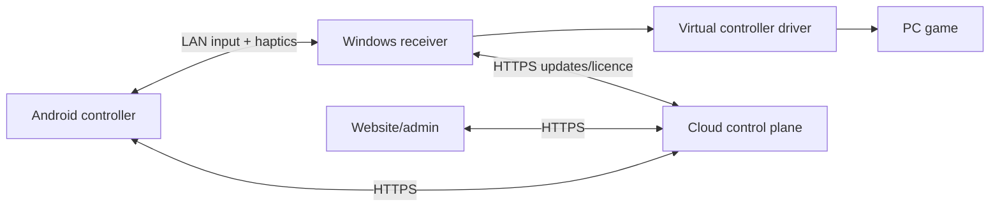
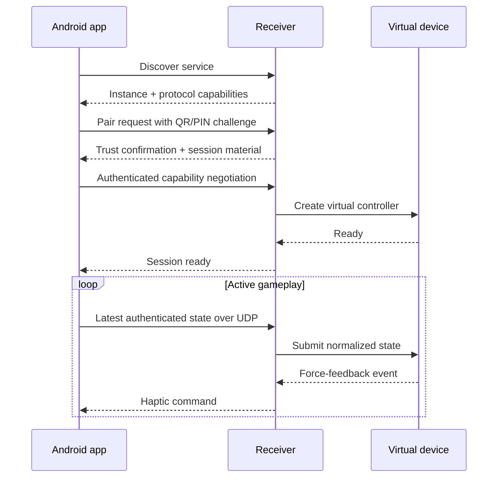
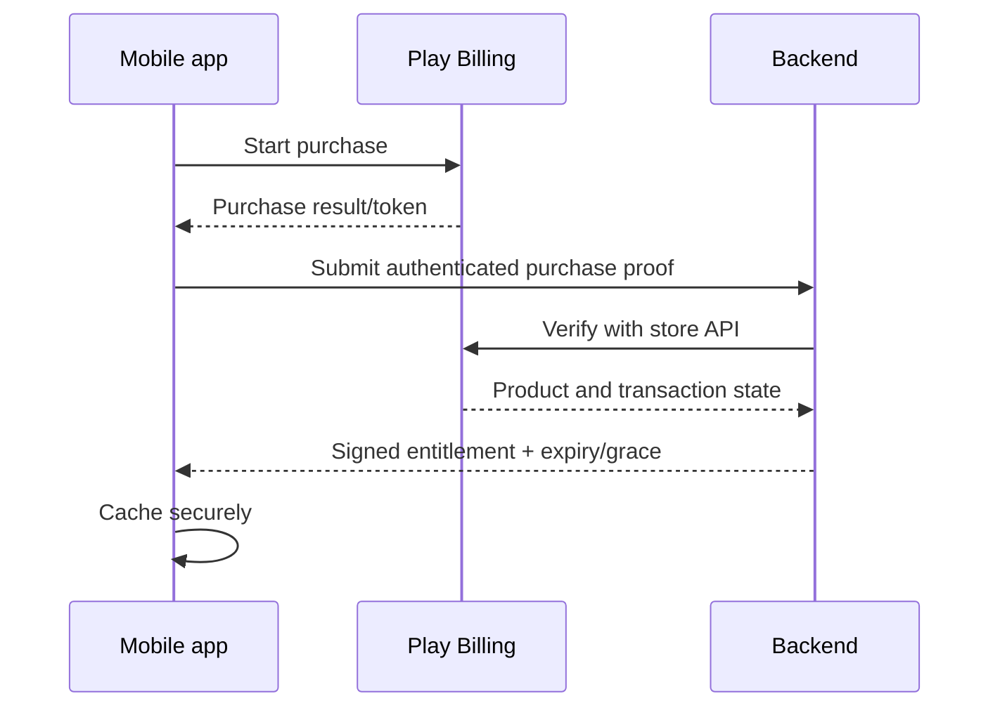

# Virtual Steering Controller — System Architecture

## 1. Architecture objectives

The system converts high-frequency touch and motion input from an Android device into a standard controller visible to a Windows game. It must remain responsive during network variation, pair securely without expert configuration, operate when the cloud is unavailable, and support commercial entitlements without placing cloud services in the real-time path.

Primary quality attributes, in order:

1. Input safety and correctness.
2. Consistent low latency and low jitter.
3. Connection reliability.
4. Installation and onboarding success.
5. Compatibility and replaceable dependencies.
6. Security and privacy.
7. Maintainability and observability.
8. Cloud scalability and cost efficiency.

## 2. System context



The mobile-to-receiver link is the data plane. Accounts, purchases, sync, releases, and analytics form the control plane. The data plane must continue functioning during a backend outage.

## 3. Component model

### 3.1 Android controller

#### Sensor acquisition

- Subscribes to gyroscope, accelerometer, and rotation-vector sensors based on mode.
- Timestamps samples using a monotonic clock.
- Transforms device coordinates into the active landscape orientation.
- Rejects impossible/non-finite values.
- Publishes capability information: sensors, safe sample rates, haptic support, screen refresh, and device orientation.

#### Sensor fusion and calibration

- Maintains neutral orientation and gyro bias.
- Converts motion into normalized steering values.
- Applies centre offset, dead zone, curve, saturation, inversion, and bounded smoothing.
- Exposes raw and processed values to the calibration screen.
- Stores calibration per device/mode and optionally per game profile.

Order of operations should be explicit and tested:

```text
raw orientation
→ orientation compensation
→ neutral/bias correction
→ steering range mapping
→ dead zone
→ response curve
→ saturation/clamp
→ optional low-delay filter
→ normalized axis
```

#### Touch input engine

- Performs hit testing independently of screen navigation.
- Supports buttons, toggles, analog pedals, steering wheel, joystick, touchpad, and decorative labels.
- Resolves multi-touch pointer ownership so one finger cannot unexpectedly control two elements.
- Emits full controller state snapshots rather than depending only on edge events.
- Immediately releases controls when a pointer is cancelled.

#### State aggregator

- Combines processed sensor state and touch state.
- Maintains one authoritative normalized controller state.
- Tracks changed-button edges for optional redundant delivery.
- Supplies state to renderer and packet publisher without blocking either.

#### Packet publisher

- Samples the latest authoritative state at a configured 120 Hz initially.
- May adapt between 60/120/240 Hz based on device/network capability.
- Creates fixed-size authenticated datagrams.
- Never queues multiple stale states; overwrite pending state with the newest.
- Maintains sequence number and sender timestamp.

#### Connection manager

- Discovers receivers.
- Runs pairing and stores trust records.
- Negotiates protocol version and capabilities.
- Measures RTT, heartbeat health, jitter, and loss.
- Reconnects with bounded exponential backoff outside active play and aggressive short recovery during play.
- Transitions to disconnected state deterministically.

#### Haptic renderer

- Accepts force-feedback envelopes from the receiver.
- Maps unsupported frequencies to device capabilities.
- Rate-limits commands to avoid thermal/battery problems.
- Separates UI haptics from game rumble.
- Lets users scale or disable intensity.

### 3.2 Windows receiver

#### Discovery service

- Publishes service type, instance ID, receiver version, protocol range, and pairing state through mDNS/DNS-SD.
- Provides a UDP broadcast fallback for networks where multicast is unavailable.
- Does not expose account or permanent secret information.

#### Pairing service

- Displays a short-lived QR payload and PIN.
- Requires explicit receiver approval for new devices unless the user initiated pairing mode.
- Exchanges device public identity and negotiates session material.
- Stores trusted devices encrypted with Windows facilities.
- Supports rename, revoke, and “forget all devices.”

#### Session supervisor

- Owns session lifecycle and cancellation.
- Negotiates packet rate, features, and protocol version.
- Rejects packets from the wrong endpoint/session.
- Updates health state and initiates fail-safe neutralization on timeout.
- Ensures a reconnect cannot leave the previous virtual controller active.

#### UDP ingress

- Uses a preallocated receive buffer.
- Validates source, length, version, session, authentication tag, and sequence.
- Records malformed/drop/reorder metrics.
- Passes the newest valid snapshot to the pipeline.
- Does not perform database or UI work.

#### Input pipeline

- Converts wire values to internal axes.
- Applies receiver-side mappings needed for game profiles.
- Preserves edge-sensitive button transitions.
- Clamps all values.
- Sends state to the selected virtual-device backend.
- Exposes a read-only snapshot to UI diagnostics through throttled IPC.

#### Virtual-device adapter

Define an interface conceptually equivalent to:

```text
create(capabilities) -> device
submit(controller_state)
poll_force_feedback() -> feedback_events
neutralize()
disconnect()
health() -> backend_status
```

Driver-specific handles, errors, install detection, and mapping must not leak beyond this adapter. A fake backend supports development, CI, and packet-pipeline testing.

#### Profile manager

- Loads built-in signed profiles and user profiles.
- Validates schema and version.
- Associates profiles with executable names only with explicit user confirmation.
- Separates controller layout from receiver mapping so users can reuse either.
- Migrates older schemas without destructive loss.

#### Diagnostics service

- Produces live metrics without reading secret material.
- Maintains rotating local logs.
- Exports a redacted ZIP/text support bundle only on user action.
- Provides distinct failure codes for discovery, pairing, driver, firewall, protocol, and network health.

#### Updater

- Fetches a signed release manifest.
- Verifies channel, compatibility, size, hash, and signature.
- Downloads atomically to a temporary location.
- Installs only after user consent unless policy explicitly enables background updates.
- Supports rollback or repair when practical.

### 3.3 Virtual controller layer

The game should see a familiar controller. MVP target is an Xbox-compatible device with axes for steering and pedals and mapped digital buttons.

Example default mapping:

| Mobile control | Virtual output |
|---|---|
| Steering | Left stick X |
| Throttle | Right trigger |
| Brake | Left trigger |
| Handbrake | A or profile-selected button |
| Gear up/down | B/X or bumpers |
| Camera | Right stick |
| Pause/menu | Start |

Profile mappings override defaults. DirectInput or dedicated wheel/HID modes are later backends, not ad-hoc branches inside the input pipeline.

### 3.4 Cloud control plane

Use a modular monolith with the following boundaries:

#### Identity module

- Optional accounts for sync and cross-device entitlement experiences.
- OIDC/passwordless authentication.
- Session issuance, refresh, revocation, and deletion.

#### Billing module

- Receives purchase proof from mobile.
- Verifies it with the store server API.
- Stores transaction state and computes entitlement.
- Processes renewal, cancellation, grace, hold, refund, and revocation updates.
- Returns signed/cacheable entitlement assertions.

#### Device module

- Registers installations and named devices.
- Enforces only clearly disclosed device limits.
- Supports remote revocation.

#### Profile module

- Stores private profile documents and versions.
- Validates schema and maximum size.
- Resolves conflicts without silently overwriting local changes.
- Community publishing remains disabled until moderation exists.

#### Release module

- Maintains stable/beta channels.
- Serves signed manifests and compatibility requirements.
- Supports staged rollout and emergency block of a compromised build.

#### Analytics module

- Accepts only allowlisted event names and properties.
- Rejects raw sensor/controller streams.
- Applies retention and deletion rules.

## 4. Connection and pairing sequence



### Pairing states

```text
Unpaired → Discovering → PairingPending → Trusted → Connecting → Active
                                                    ↘ Failed
Active → Degraded → Reconnecting → Active
Active/Degraded/Reconnecting → TimedOut → Neutralized → Disconnected
```

Every transition has a deadline and user-readable error code.

## 5. Gameplay packet design

Illustrative format; final byte offsets belong in a versioned protocol specification.

| Field | Purpose |
|---|---|
| Magic/version | Fast rejection and compatibility |
| Flags | Capabilities, edge redundancy, mode |
| Session ID | Prevent cross-session acceptance |
| Sequence | Loss/reorder detection |
| Sender timestamp | Packet/sensor age diagnostics |
| Steering | Signed normalized axis |
| Throttle/brake/clutch | Unsigned normalized axes |
| Auxiliary axes | Camera/joystick/custom input |
| Buttons | Bitmask |
| Recent edges | Recover short button transitions |
| Authentication tag | Reject forged/modified packets |

Requirements:

- Maximum packet remains far below typical UDP MTU.
- Network byte order is specified.
- Integer encoding is preferred over floats on wire.
- Receiver validates exact supported length.
- Authentication covers header and payload.
- Sequence comparison handles wraparound.
- Sender may repeat recent button edges for a few packets.
- Receiver applies only newer valid snapshots.

## 6. Latency budget

| Stage | Target |
|---|---:|
| Sensor/touch acquisition age | 0–4 ms typical |
| Mobile transform and aggregation | <1 ms |
| Wait to next packet publication | 0–8.3 ms at 120 Hz |
| Healthy LAN transit | 1–8 ms typical |
| Receiver validation and mapping | <1 ms |
| Virtual-device submission | <2 ms |
| Total median software/network path | <15 ms target |

Do not advertise a latency number derived only from ICMP ping. Product measurement must distinguish:

- Round-trip time.
- Jitter.
- Packet loss/reordering.
- Sensor age when packet was created.
- Receiver processing duration.
- Virtual backend submission duration.

End-to-end game response additionally includes the game’s input polling, simulation step, rendering, display scan-out, and cannot be fully controlled by this product.

## 7. Jitter, loss, and smoothing policy

- Never build a large jitter buffer for control input.
- Apply newest complete state immediately.
- Drop old/reordered snapshots while preserving missing critical button edges through redundancy/reliable events.
- Use short, bounded interpolation only if tests show an improvement; make it mode-specific.
- Detect Wi-Fi degradation and recommend 5 GHz/6 GHz, hotspot, Ethernet on PC, or future USB mode.
- If no valid state arrives within the soft timeout, mark degraded.
- At the hard timeout, submit neutral state and release all buttons.

Proposed defaults:

- Heartbeat/degraded threshold: 100 ms.
- Neutralization threshold: 250 ms, configurable only within safe limits.
- Session teardown: several seconds after failed recovery.

Validate these values through real gameplay testing.

## 8. Fail-safe behaviour

Safety means the car does not remain at full throttle or steering after failure.

Neutralize when:

- Session authentication fails repeatedly.
- Hard packet timeout occurs.
- Mobile application explicitly disconnects.
- Receiver stops or updates.
- Virtual backend reports inconsistent state.
- Windows changes network/profile state and the session cannot validate continuity.

The receiver owns final neutralization; it must not rely on the phone sending a release packet.

## 9. Haptic/force-feedback path

1. Game sends rumble/force-feedback through the virtual device.
2. Backend adapter converts it to a normalized envelope.
3. Receiver timestamps, caps, and transmits the newest feedback command.
4. Mobile maps it to available vibration capabilities.
5. User intensity and accessibility settings are applied.

Feedback loss is acceptable; it must never delay upstream control input. Place feedback in a separate task/channel with independent backpressure.

## 10. Profile architecture

Separate concerns:

- **Mobile layout:** position, size, type, style, and touch behaviour.
- **Input processing:** sensitivity, range, dead zone, curve, smoothing.
- **Receiver mapping:** normalized control to virtual axes/buttons.
- **Game association:** executable/version and recommended in-game settings.

Profile fields include schema version, ID, title, author, timestamps, target game, capabilities, layout, processing parameters, mapping, and integrity/source metadata.

Built-in profiles are immutable templates. Editing creates a user copy. Cloud conflict resolution creates versions rather than overwriting both branches.

## 11. Billing and entitlement flow



Rules:

- Client purchase callbacks are not authoritative.
- Lifetime and subscription entitlements are distinct.
- Refund/revocation eventually removes access according to policy.
- During temporary backend/network failure, previously verified users receive a limited offline grace period.
- Local gameplay cannot depend on an API call at session start.

## 12. Deployment architecture

### Production services

- Stateless API instances behind managed HTTPS ingress.
- Managed PostgreSQL with automated backups and point-in-time recovery.
- Object storage/CDN for receiver installers and release assets.
- Background worker for billing and cleanup.
- Secrets manager for API credentials and signing-related service credentials.
- Central error reporting and metrics.

No Kubernetes is required for MVP. Begin with one production environment and one isolated staging environment. Infrastructure should be reproducible through Terraform/OpenTofu or provider-native declarative configuration.

### Release channels

- Internal: developers only.
- Closed alpha: invited test devices.
- Beta: larger Play testing group and opt-in receiver channel.
- Stable: staged production rollout.

Compatibility policy maps mobile version, receiver range, protocol version, and profile schema. Incompatible pairs must fail with an actionable upgrade message, not mysterious connection errors.

## 13. Database conceptual model

| Entity | Key relationships/purpose |
|---|---|
| User | Owns devices, entitlements, profiles, consents |
| Installation | Anonymous/app installation identity |
| Device | Named mobile/receiver device tied optionally to user |
| Purchase | Store transaction evidence and state |
| Entitlement | Computed access to product capability |
| Profile | Current logical profile |
| ProfileVersion | Immutable versioned profile document |
| Release | Platform build and rollout state |
| CompatibilityRule | Valid client/receiver/protocol combinations |
| Consent | Versioned analytics/privacy choice |
| AuditEvent | Administrative/billing-sensitive changes |

Use UUIDs, UTC timestamps, uniqueness constraints on store purchase identifiers, optimistic versioning for profiles, and migrations for all schema changes.

## 14. Security threat model summary

| Threat | Control |
|---|---|
| LAN attacker injects steering | Pairing trust + per-session authenticated packets |
| Replay of recorded packets | Session ID, sequence, timestamps, rotating session key |
| Malicious discovery spam | Rate limits, explicit pairing mode, fallback selection |
| Modified receiver installer | Code signing, HTTPS, signed manifest, hash verification |
| Stolen purchase token | Server verification, secure storage, redacted logs |
| Entitlement patching | Server-issued assertion, obfuscation only as secondary control |
| Malicious imported profile | Strict schema, size limits, no executable content |
| Admin account compromise | MFA, least privilege, audit logs |
| Sensitive support bundle | User-initiated export, redaction, retention controls |

Conduct a full threat-model review before public beta and after any Internet-remote-control feature is proposed.

## 15. Privacy architecture

- Controller packets remain local and are not persisted by default.
- Analytics contains event categories, coarse device capabilities, and failure codes—not raw control sequences.
- IP addresses are not retained as profile/account data.
- Support uploads require explicit action and preview/redaction where possible.
- Users can play locally without creating a cloud account, except where store billing naturally identifies the Play account to Google.
- Cloud users can export/delete their profiles and account.
- Retention periods are documented and enforced by jobs.

## 16. Observability and support

Every connection gets a random local session correlation ID. It may appear in local logs but is uploaded only with consent.

Dashboard groups:

- Activation funnel.
- Pairing failures by coarse category.
- Protocol-version distribution.
- Receiver and mobile crash-free rate.
- Healthy-session latency/jitter percentiles.
- Driver install/health failures.
- Purchase and restore errors.
- Release adoption and rollback signals.

Logs use structured events and redaction. High-frequency packet logs are disabled by default and can be sampled temporarily through a local diagnostic mode.

## 17. Scaling model

LAN gameplay creates essentially no server bandwidth. Cloud load scales with account activity, entitlement refresh, profile sync, release checks, and analytics—not controller frequency.

Initial backend design can support substantial adoption using:

- Stateless horizontally scalable API.
- Indexed PostgreSQL queries.
- CDN-cached release manifests and downloads.
- Batched analytics.
- Entitlement caching with bounded expiry.
- Rate limits per installation/account/IP.

Avoid premature microservices. Split a module only when independent scaling, security isolation, or team ownership creates measurable value.

## 18. Architectural acceptance tests

- Phone and receiver pair without manual IP on normal home Wi-Fi.
- Manual/QR fallback works when discovery fails.
- Forged or replayed UDP packets are rejected.
- 5% packet loss does not leave buttons stuck.
- Network interruption neutralizes controller within the specified timeout.
- Reconnect does not duplicate virtual devices.
- Cloud outage does not interrupt an authenticated local gameplay session.
- Receiver update cannot install an artifact with an invalid signature/hash.
- A refunded test purchase eventually changes entitlement correctly.
- Old profile schemas migrate without losing the original copy.
- Diagnostic export contains no secret or purchase tokens.

